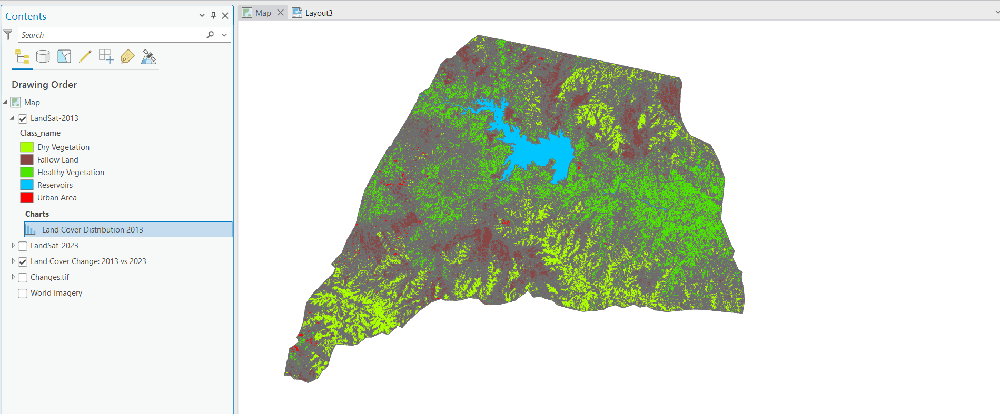
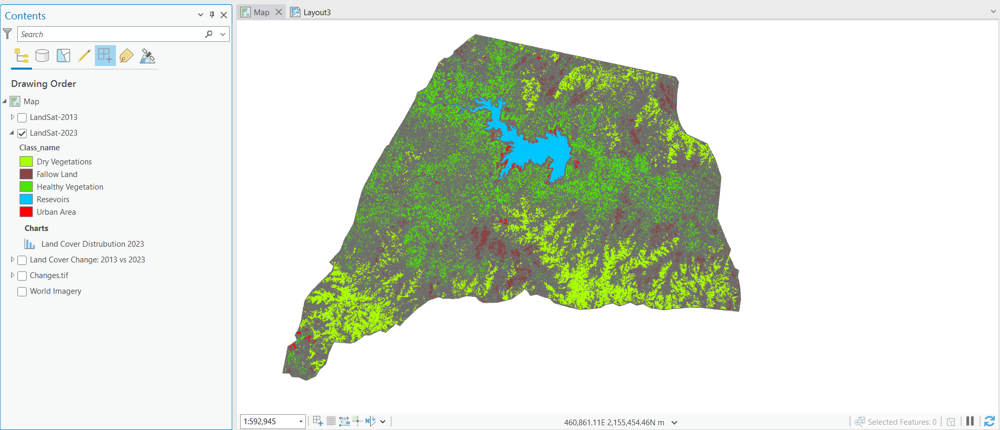

# Land Cover Change Analysis (2013-2023)

Project Description
This project analyzes land cover changes between 2013 and 2023 using LandSat satellite imagery. The analysis compares different vegetation types, urban areas, and water reservoirs to understand how land use has transformed over a decade.

Key Features
Comparative visualization of land cover in 2013 vs 2023

Classification of different land cover types:

Dry Vegetation

Fallow Land

Healthy Vegetation

Reservoirs

Urban Areas

Change detection analysis showing conversions between land cover categories

Statistical charts showing land cover distribution for both years

Data Sources
LandSat satellite imagery (2013 and 2023)

World Imagery basemap

Analysis Categories
The project examines changes between these land cover classes:

Vegetation Changes:

Dry Vegetation ↔ Healthy Vegetation

Vegetation ↔ Fallow Land

Urbanization:

Vegetation/Fallow Land → Urban Areas

Water Resources:

Changes in Reservoir areas

Conversion between water and other land types

Technical Implementation
GIS-based change detection methodology

Classification algorithms for land cover categorization

Statistical analysis of land cover distribution changes

Visualization of spatial patterns in land use change

How to Use
Toggle between the 2013 and 2023 layers to compare land cover

Explore the change detection layer to see specific conversions

View the charts for quantitative analysis of changes

Insights
This analysis can help understand:

Urban expansion patterns

Vegetation health trends

Agricultural land use changes

Water resource management

Future Enhancements
Add more temporal data points for trend analysis

Incorporate climate data for correlation analysis

Develop predictive models for future land cover changes
